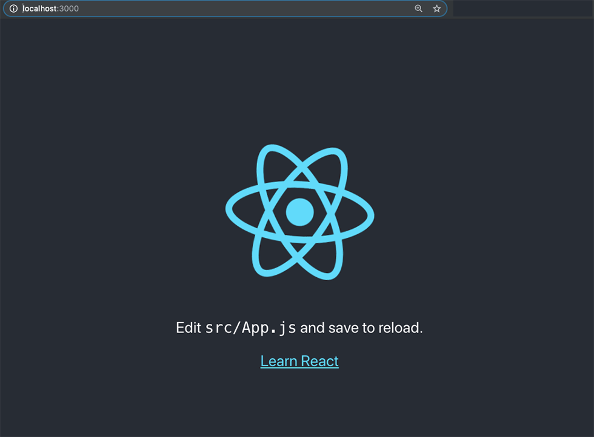
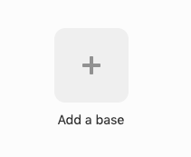
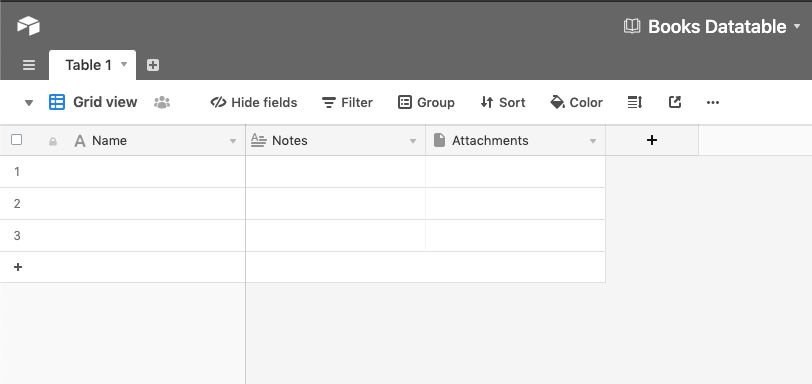
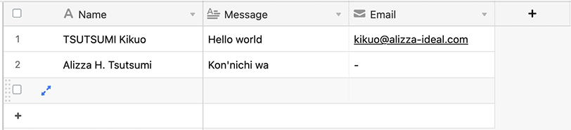
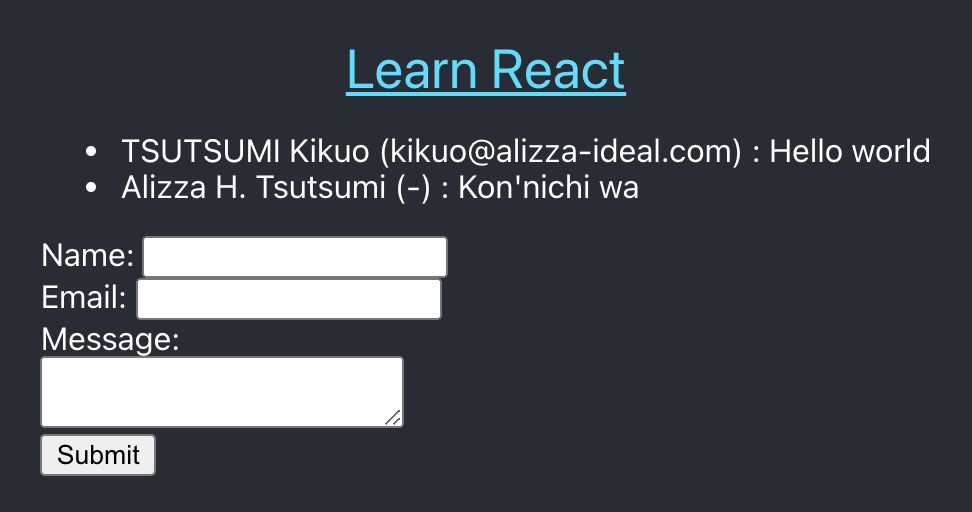
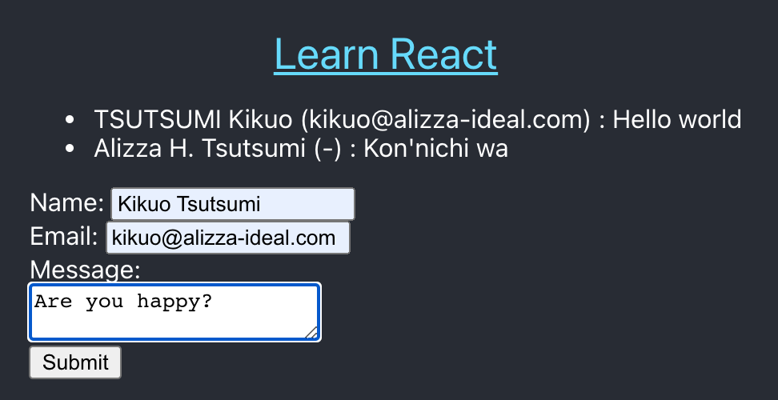
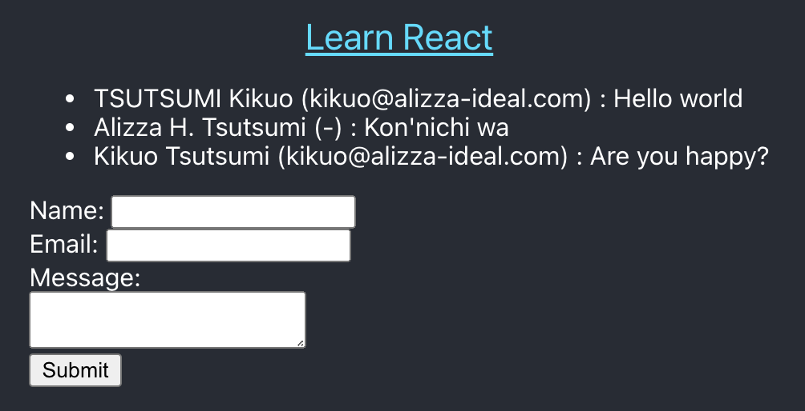
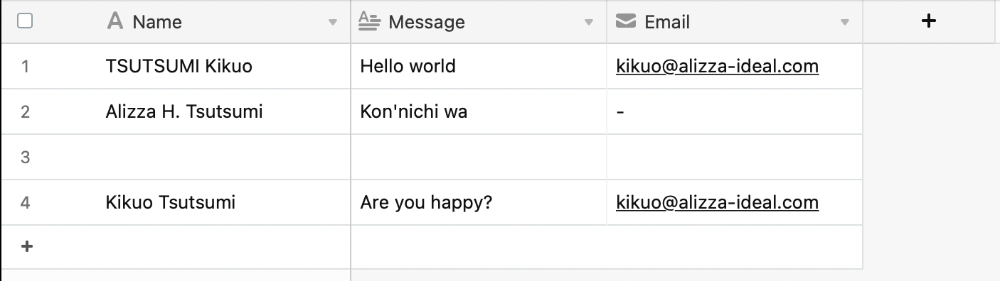

このエントリでは、Airtable スプレッドシートのデータ管理が、どんなに簡単か紹介します。
次に、Airtable APIを使用して、データを読み込むReactアプリケーションを作成します。

このエントリを読み終えると、Reactアプリを作成して、Airtableを使用して
データをクラウドに保存する方法を理解できるようになります。

Airtable API にはアクセスレートに制限があります。
１秒あたり５リクエストの制限です。
とはいえ、合理的な値ですね。

このレートを超えると、429 ステータスコードが返ってきます。
そうなると、リクエストの送信前に３０秒待たなければなりません。

#### 前提条件

このエントリを参考にして React アプリを試してみるには、
無料の Airtable アカウントと API キーを入手する必要があります。

#### 新しい React アプリをセットアップする

まず、新しいReactプロジェクトを作成しましょう。
`create-react-app` ジェネレータツールをインストールしたら、
ターミナルウィンドウから次のコマンドを実行してください。
実行すると、Reactアプリに必要なすべてのコードが入った
新しいディレクトリが作成されます。

```shell
    create-react-app react-airtable-app
```

プロジェクトのディレクトリができたら、その中に `cd` してください。
このエントリでは、とくに説明しなければ、そのディレクトリのトップで
すべてのコマンドを実行します。

プロジェクトディレクトリに移動したら、コマンド `yarn start` を実行して、
ブラウザに切り替え、デフォルトの React アプリが動作しているか確認しましょう。



#### Airtable のセットアップ

それでは、Airtableの[サイト(https://airtable.com/)](https://airtable.com/)に
サインインしましょう。サインインすると、ダッシュボード画面がヒュおじされます。
このページで新しいベースを作成できます。

Airtableの用語では、ベースはデータベースのことです。

先に進む前に、まず API キーを取得します。
アカウントの Overview ページを表示すると、
ページの中ほどに API セクションがあります。


上の画像の点々が表示されたボックスをクリックすると、
API key が表示されます。それをコピーして保存しておいてください。
後で Airtable API を使って、
Airtable のベースにアクセスするために必要になります。

次に、ベースを追加しましょう。サインインしたときに表示された
ダッシュボード画面に戻って、「Add a base」ボタンをクリックします。



新しいベースには、デフォルトで３つのフィールドのある
１つのテーブルが生成されています。



Reactアプリに表示しようとする内容に基づいて
このテーブルのフィールドのタイプを変更します。
同時に、いくつかデータを入力しておきます。



#### Airtable API でデータを読み出す

React アプリで Airtable API を使用するには、
`airtable` プラグインを使用します。
次のようにインストールしておきましょう。

```shell
    yarn add airtable
```

このプラグインから `Aaitable` オブジェクトを読み込み、
API key とベース ID を指定してベースオブジェクトを生成します。

```javascript
    const Airtable = require("airtable")
    const base = new Airtable({ apiKey: <<AIRTABLE_API_KEY>> }).base(
      <<AIRTABLE_BASE_ID>>
    )
```

そしてベースオブジェクトにテーブル名とビュー名、フィールド名を指定して、
データを読み込みます。ビューは Airtable で、テーブルを表示するときに
どのようなスタイルにするかを指定します。
デフォルトでは Grid view だけ生成されています。

それでは、Airtable からメッセージ一覧を読み出して表示する
`Messages` (メッセージ一覧表示) コンポーネントを作りながら解説していきます。

```javascript
    const Messages = () => {
      const [loaded, setLoaded] = useState(false);
      const [messageList, setMessageList] = useState("");
    
      useEffect(() => {
        base("Contacts")
          .select({
            view: "Grid view",
          })
```

ベースオブジェクトの `select()` メソッドを呼び出すと、
クエリーオブジェクトが返ってきます。
そのオブジェクトの読み込みメソッドを使って
データを読み込みます。

データを読み込むメソッドはいくつかありますが、
今回は `firstPage()` メソッドを使いました。

```javascript
          .firstPage((err, records) => {
            if (err) {
              console.log("Error: ", err);
              return;
            }
```

フィールドのデータを読み込むには、 `firstPage()` から返ってきた
`records` オブジェクトの `get()` メソッドを使います。
ここでは、読み込みながら `<ul>` HTML タグで箇条書きに整形しました。

```javascript
            const list = (
              <ul style={{ textAlign: "left" }}>
                {records.map((r, index) => {
                  const n = r.get("Name");
                  const e = r.get("Email");
                  const m = r.get("Message");
                  if (n === undefined) {
                    return "";
                  }
                  return (
                    <li key={index}>
                      {n} ({e}) : {m}
                    </li>
                  );
                })}
              </ul>
            );
            setMessageList(list);
          });
        setLoaded(true);
        return () => {
          setLoaded(false);
        };
      }, [loaded]);
    
      return <div>{messageList}</div>;
    };
```

最終的に、 `App` コンポーネントからメッセージ一覧表示コンポーネントを呼び出して完了です。

```javascript
    function App() {
    
        ...
	
          Learn React
        </a>
        <div>
          <Messages />
    }
```


#### Airtable へデータを保存する

次に、Web フォームに入力されたデータを Airtable に保存してみましょう。
まずは、フォームを作成します。



つぎに、先ほどと同じように、
`MessageForm` コンポーネントを作っていきます。

保存するベースとテーブルの指定方法は、先程と同じです。

フォームに入力されたときと、フォームがサブミットされたときは、
それぞれ `handleChange` と `handleSubmyt` が呼び出されるようにしておきます。

```javascript
    const MessageForm = () => {

      ...

      const handleChange = (event) => {
        ...
      };
      
      const handleSubmit = (event) => {
        ...
      };

      return (
        <div style={{ textAlign: "left" }}>
          <form onSubmit={handleSubmit}>
            <div>
              <label>
                Name:{" "}
                <input
                  type="text"
                  name="name"
                  value={name}
                  onChange={handleChange}
                />
              </label>
            </div>
            <div>
              <label>
                Email:{" "}
                <input
                  type="email"
                  name="email"
                  value={email}
                  onChange={handleChange}
                />
              </label>
            </div>
            <div>
              <label>
                <div>Message:</div>
                <div>
                  <textarea
                    name="message"
                    value={message}
                    onChange={handleChange}
                  />
                </div>
              </label>
            </div>
            <div>
              <input type="submit" />
            </div>
          </form>
        </div>
      );
    };
```

コンポーネントにフォームフィールドのオブジェクトに対応する変数を追加します。
そして、フォームが変更されたら、入力された値を格納するようにします。

```javascript
    const MessageForm = () => {
      const [name, setName] = useState("");
      const [email, setEmail] = useState("");
      const [message, setMessage] = useState("");
    
      const handleChange = (event) => {
        switch (event.target.name) {
          case "name":
            setName(event.target.value);
            break;
          case "email":
            setEmail(event.target.value);
            break;
          case "message":
            setMessage(event.target.value);
            break;
          default:
            console.log("key not found");
            break;
        }
      };

    ...
```

最後に、サブミットされたときに Airtable に保存するコードを書きます。

```javascript
      const handleSubmit = (event) => {
        event.preventDefault();
    
        base("Contacts").create(
          [
            {
              fields: {
                Name: name,
                Message: message,
                Email: email,
              },
            },
          ],
          (err, records) => {
            if (err) {
              console.log("Error: ", err);
              return;
            }
    
            setName("");
            setEmail("");
            setMessage("");
          }
        );
    
        window.location.reload();
      };
```

`App` 関数から、 `MessageForm` コンポーネントを呼び出すようにすれば完成です。

```javascript
    function App() {
    
        ...
	
          Learn React
        </a>
        <div>
          <Messages />
	  <MessageForm />
	</div>
    }
```

コンポーネントの全体のコードも書いておきます。

```javascript
    const MessageForm = () => {
      const [name, setName] = useState("");
      const [email, setEmail] = useState("");
      const [message, setMessage] = useState("");
    
      const handleChange = (event) => {
        switch (event.target.name) {
          case "name":
            setName(event.target.value);
            break;
          case "email":
            setEmail(event.target.value);
            break;
          case "message":
            setMessage(event.target.value);
            break;
          default:
            console.log("key not found");
            break;
        }
      };
      
      const handleSubmit = (event) => {
        event.preventDefault();
    
        base("Contacts").create(
          [
            {
              fields: {
                Name: name,
                Message: message,
                Email: email,
              },
            },
          ],
          (err, records) => {
            if (err) {
              console.log("Error: ", err);
              return;
            }
    
            setName("");
            setEmail("");
            setMessage("");
          }
        );
    
        window.location.reload();
      };

      return (
        <div style={{ textAlign: "left" }}>
          <form onSubmit={handleSubmit}>
            <div>
              <label>
                Name:{" "}
                <input
                  type="text"
                  name="name"
                  value={name}
                  onChange={handleChange}
                />
              </label>
            </div>
            <div>
              <label>
                Email:{" "}
                <input
                  type="email"
                  name="email"
                  value={email}
                  onChange={handleChange}
                />
              </label>
            </div>
            <div>
              <label>
                <div>Message:</div>
                <div>
                  <textarea
                    name="message"
                    value={message}
                    onChange={handleChange}
                  />
                </div>
              </label>
            </div>
            <div>
              <input type="submit" />
            </div>
          </form>
        </div>
      );
    };
```

それでは、ブラウザに戻ってフォームに入力してみましょう。



サブミットすると、Airtable にデータが保存され、
最初に作った Airtable からデータを読み込む
`Messages` コンポーネントが、
保存されたデータを表示します。






#### API key を守る

うまく動作しています。

しかし、Airtable API key がソースコードに直接書かれているので、
Web アプリを使っている人が API key を知ることができてしまいます。

API key を使うと、勝手にデータを保存されたり、削除されてしまいます。

そこで、サーバーの環境変数に API key をセットしておくようにして、
見えないようにしましょう。

まず、`react-dotenv` プラグインをインストールます。

```javascript
yarn add react-dotenv
```

環境変数にセットする API key は、プロジェクトのトップディレクトリに
`.env` というファイルを作って保存します。

```
File: .env
- - - -
AIRTABLE_API_KEY=<<API_KEY>>
```

そして、 `App.js` でプラグインを読み込みます。

```javascript
import env from "react-dotenv"
```

あとは、Airtable ベースを生成するときに指定すれば完了です。

```javascript
    const Airtable = require("airtable")
    const base = new Airtable({ apiKey: env.AIRTABLE_API_KEY }).base(
      <<AIRTABLE_BASE_ID>>
    )
```

#### まとめ

このエントリを最初から試してみれば、 ReactJS と Airtable を使って
動的な Web アプリを作る方法がわかったと思います。

実際にReactコンポーネントを使ってみれば、
UIを構築するときにおおいに時間を節約することができます。
